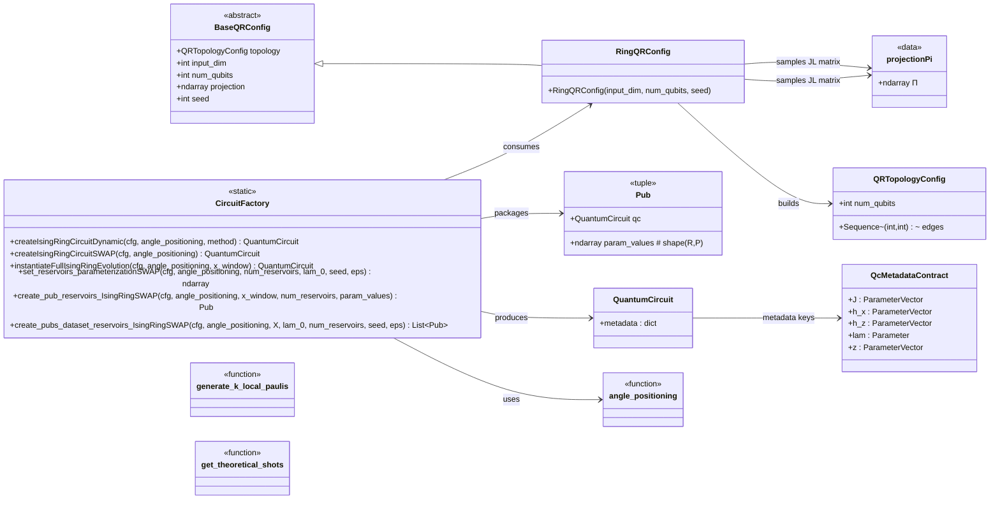

# `src.qrc.circuits` package overview

This package contains the **circuit-building utilities** used to turn a dataset of input windows
`X ∈ R^{N×w×d}` into a list of **PUBs** (parameterized quantum circuit + parameter values) that can be
executed by a runner (e.g., an Aer runner) and then featurized by downstream components.

It is intentionally lightweight and focused on:

- **Config objects** describing qubit topology and Johnson–Lindenstrauss (JL) projections.
- **Angle positioning** utilities (data-to-rotation maps).
- A **CircuitFactory** that constructs the paper’s *SMC / Ising ring* circuits and packages them into PUBs.
- Utility helpers for **observable generation** and **shot-count heuristics**.

---

## Big picture

### Data flow (high level)

1. **Configure** a reservoir topology + JL projection: `RingQRConfig(input_dim=d, num_qubits=n)`.
2. Choose a **data injection map**: `angle_positioning`.
3. Use **CircuitFactory** to:
   - build a *single-step* SMC circuit (data injection → Ising unitary → contraction),
   - “unroll” it over a window `x_window ∈ R^{w×d}` by repeatedly binding `z_t = x_t @ Π`,
   - sample **R** reservoir parameterizations `(J, h_x, h_z, λ)` shared across all windows,
   - return a list of **PUBs**: one pub per input window.
4. Downstream (outside this package):
   - a **runner** executes PUBs and returns `Results`,
   - a **feature map retriever** produces features `Φ ∈ R^{N×D}` using chosen observables.

### High-level class diagram



---

## Modules and main objects

## `configs.py`

### `sample_jl_projections_gaussian(input_dim, zeta, seed) -> np.ndarray`
Samples a JL projection matrix `Π ∈ R^{d×ζ}` with entries `~ N(0, 1/ζ)`.
Used as `z = x @ Π` to map a `d`-dimensional input into an injection space of size `ζ`
(typically `ζ = num_qubits`).

### `QRTopologyConfig`
Dataclass holding:
- `num_qubits`: number of reservoir qubits `n`,
- `edges`: list/tuple of two-qubit interaction edges `(q1, q2)`.

### `BaseQRConfig`
Abstract base class describing what a circuit config must expose:
- topology, input dimension, qubit count, JL projection, seed.

### `RingQRConfig(BaseQRConfig)`
Concrete config for a **ring topology** reservoir:
- Builds a ring interaction graph via `ring_topology(num_qubits)`,
- Samples the JL projection `Π` with `zeta=num_qubits`.

### `ring_topology(num_qubits) -> QRTopologyConfig`
Creates edges:
- `(0,1), (1,2), …, (n-2,n-1)` and (if `n>2`) closes the ring with `(n-1,0)`.

---

## `utils.py`

### Angle positioning (data → rotation angles)

Both functions accept `z` as a Qiskit `ParameterVector` and return a list of angle expressions.
We use by default the following angle positionning utiliy.
- `angle_positioning_tanh(z, scale=π(1-1e-6))`  
  Elementwise: `θ_j(z) = scale · tanh(z_j)` implemented using `exp()` only
  (compatible with Qiskit’s `ParameterExpression`).

### Observables generation

- `generate_k_local_paulis(locality, num_qubits) -> List[SparsePauliOp]`  
  Generates all Pauli strings on `num_qubits` with locality ≤ `k`
  (i.e., up to `k` non-identity letters).  
  **Convention**: qubit 0 corresponds to the **rightmost** character in the Pauli string.

### Shot count heuristic for classical shadows

- `get_theoretical_shots(eps, delta, locality, num_data_pts, num_obs, num_draws) -> int`  
  Returns a recommended number of snapshots ensuring (heuristically) a uniform error bound
  across all draws/data points/observables.

---

## `circuit_factory.py`

### Core idea: PUBs

A **PUB** is a tuple `(qc, param_values)` where:

- `qc` is a `QuantumCircuit` produced by the factory,
- `param_values` has shape `(R, P)` and contains `R` different reservoir parameterizations.

The runner expects a **specific parameter column order**, and the circuit stores the
corresponding parameter objects in `qc.metadata`:

- `qc.metadata["J"]` : `ParameterVector` for two-qubit ZZ couplings,
- `qc.metadata["h_x"]` : `ParameterVector` for local X fields,
- `qc.metadata["h_z"]` : `ParameterVector` for local Z fields,
- `qc.metadata["lam"]` : `Parameter` for contraction strength,
- `qc.metadata["z"]` : `ParameterVector` for input injection parameters.

> **Important**: Downstream runners typically reconstruct the binding order from these metadata keys.

### `CircuitFactory.createIsingRingCircuitDynamic(cfg, angle_positioning, method="density_matrix")`
Builds a **single-step** circuit:
1) Inject data via `Ry(θ(z))` on each reservoir qubit,  
2) Apply an Ising unitary `W` (ZZ on edges + local Rz/Rx),  
3) Apply a **stochastic contraction** using a coin qubit + conditional reset of the reservoir.

This variant uses measurement + conditional logic (classical bit).

### `CircuitFactory.createIsingRingCircuitSWAP(cfg, angle_positioning)`
Builds a **deterministic** single-step contraction implementing

`E_λ(ρ) = λ ρ + (1-λ) |+⟩⟨+|^{⊗n}`

via a Stinespring-like dilation:
- reservoir qubits + `n` aux qubits initialized to `|+⟩^{⊗n}` + a coin qubit controlling swaps,
- reset of environment qubits to trace them out.

### `CircuitFactory.instantiateFullIsingRingEvolution(cfg, angle_positioning, x_window)`
Turns a window `x_window ∈ R^{w×d}` into a circuit representing `w` consecutive SMC steps:

- For each timestep `t`, project `x_t` into `z_t = x_t @ Π` (with `Π = cfg.projection`),
- Bind the step circuit’s `z` parameters to `z_t`,
- Compose the bound step circuit into an accumulating circuit initialized at `|+⟩^{⊗n}`.

The resulting circuit remains parameterized by `(J, h_x, h_z, λ)`.

### `CircuitFactory.set_reservoirs_parameterizationSWAP(cfg, angle_positioning, num_reservoirs, lam_0, seed, eps)`
Samples **R** reservoir parameterizations (shared across all windows):
- `J`, `h_x`, `h_z` drawn i.i.d. Uniform(`[-π, π]`),
- `λ_0 = lam_0` for reservoir 0,
- remaining `λ_r ~ Uniform(eps, 1-eps)`.

Returns `param_values ∈ R^{R×P}` in the expected metadata-driven order:
`[J..., h_x..., h_z..., lam]`.

### `CircuitFactory.create_pub_reservoirs_IsingRingSWAP(...)`
Creates a single PUB for one window:
- Builds the full unrolled circuit for that window,
- Pairs it with the shared `param_values`.

### `CircuitFactory.create_pubs_dataset_reservoirs_IsingRingSWAP(...)`
Creates the full PUBS dataset:
- Input: `X ∈ R^{N×w×d}`,
- Output: `pubs: List[Pub]` of length `N`.

---

## Minimal usage snippet

```python
import numpy as np
from src.qrc.circuits.configs import RingQRConfig
from src.qrc.circuits.utils import angle_positioning_tanh
from src.qrc.circuits.circuit_factory import CircuitFactory

cfg = RingQRConfig(input_dim=3, num_qubits=3, seed=0)

X = np.random.default_rng(0).normal(size=(10, 20, 3))  # (N,w,d)
pubs = CircuitFactory.create_pubs_dataset_reservoirs_IsingRingSWAP(
    cfg=cfg,
    angle_positioning=angle_positioning_tanh,
    X=X,
    lam_0=0.2,
    num_reservoirs=4,
    seed=0,
)
# pubs is ready to be executed by a runner (outside this package)
```

---

## Conventions & shapes

- `X`: input windows, shape `(N, w, d)`.
- `x_window`: a single window, shape `(w, d)`.
- `Π = cfg.projection`: JL projection, shape `(d, n)` where `n = cfg.num_qubits`.
- `z_t = x_t @ Π`: injected vector, shape `(n,)`.
- `param_values`: reservoir parameter matrix, shape `(R, P)` with:
  - `P = |J| + |h_x| + |h_z| + 1`.

---

## Common pitfalls

- **Observable label length must match `num_qubits`** downstream (e.g., `"ZII"` for `n=3`).
- If you build circuits outside `CircuitFactory`, they **won’t** have the metadata keys
  required by runners that rely on `qc.metadata["J","h_x","h_z","lam"]`.
