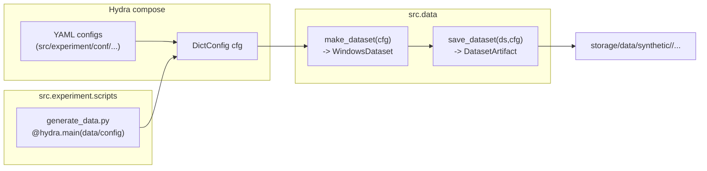

# `src.experiment` overview

The `src.experiment` package is the **entrypoint + configuration layer** of the repo.
Its job is to make experiments reproducible and composable via **Hydra/OmegaConf**:

- all experiment knobs live in YAML under `src/experiment/conf/`
- scripts under `src/experiment/scripts/` are thin wrappers that:
  1) compose a config with Hydra
  2) call the relevant library functions (e.g., `src.data.factory.*`, `QRCMaternKRRRegressor.from_config()`)

---

## Directory structure

```
src/experiment/
  conf/
    experiment.yaml
    data/
      config.yaml
      sampling/*.yaml
      process/*.yaml
      functionals/*.yaml
      noise/*.yaml
      output/*.yaml
    model/
      qrc_matern_krr.yaml
      training/default.yaml
      ...
  scripts/
    generate_data.py
```

---

## Main configs

### `conf/experiment.yaml`
Top-level **composition config** that typically selects:

- `data: config` (from `conf/data/config.yaml`)
- `model: qrc_matern_krr` (from `conf/model/qrc_matern_krr.yaml`)

This file is meant to be the “one config to rule them all” for end-to-end runs (data + model),
even if some scripts may target only a subset (e.g., `generate_data.py` targets `data/config`).

### `conf/data/config.yaml`
Defines the **dataset generation** composition:

- `sampling/*`: chooses `(N, w, d, s, burn_in, ...)`
- `process/*`: chooses the generative process (currently VARMA)
- `functionals/*`: chooses which label functionals are produced
- `noise/*`: chooses additive noise
- `output/*`: controls saving (dir/name/format/meta/config)

### `conf/model/qrc_matern_krr.yaml`
Defines the **model wiring** for `QRCMaternKRRRegressor.from_config()`:

- **QRC side**
  - `model.qrc.cfg`: circuit architecture/config (instantiated via Hydra `_target_`)
  - `model.qrc.runner`: runner object (Aer CPU/GPU)
  - `model.qrc.features.retriever`: exact/CS feature-map retriever
  - `model.qrc.features.observables`: observable generator factory
- **Learning side**
  - `model.kernel`: Matérn settings
  - `model.tuning`: hyperparameter tuning strategy (grid / powell)
  - `model.training`: split + standardization + regularization

---

## How scripts use configs

### `scripts/generate_data.py`
This is the data-generation entrypoint.

- Hydra config path: `../conf`
- Config name: `data/config` (i.e., `conf/data/config.yaml`)
- Implementation:
  - `from src.data.factory import generate_and_save_dataset`
  - calls `generate_and_save_dataset(cfg)` and prints where it wrote artifacts

---

## High-level interaction diagram



---

## Minimal usage examples

### Generate one dataset
```bash
python -m src.experiment.scripts.generate_data \
  sampling=tiny process=varma functionals=one_step noise=none \
  output.name=pytest_demo output.format=npz output.overwrite=true
```

### Run a sweep (multi-run) over dataset parameters
Hydra’s `-m` enables multirun sweeps:

```bash
python -m src.experiment.scripts.generate_data -m \
  sampling=tiny,default \
  functionals=one_step,e2_three \
  output.name=auto
```

Artifacts will land under `output.save_dir` (often `storage/data/synthetic/${process.kind}`).

---

## How this connects to `.from_config()` model construction

Once a top-level experiment config exists (e.g., `experiment.yaml`), you can construct the model as:

```python
from hydra import compose, initialize_config_dir
from pathlib import Path
from src.models.qrc_matern_krr import QRCMaternKRRRegressor

conf_root = Path("src/experiment/conf").resolve()
with initialize_config_dir(version_base=None, config_dir=str(conf_root)):
    cfg = compose(config_name="experiment")

mdl = QRCMaternKRRRegressor.from_config(cfg)
```

The idea is: **Hydra composes the full experiment config**, then your library code consumes only the slices it needs:
- `src.data.*` consumes `cfg` for data generation (`sampling/process/functionals/noise/output/...`)
- `QRCMaternKRRRegressor.from_config()` consumes `cfg.model` (and the nested `model.qrc.*` blocks)

---

## Practical notes / conventions

- Keep `hydra.job.chdir: false` (default in our configs) to avoid changing the working directory in scripts/tests.
- In tests, prefer:
  - **in-memory OmegaConf configs** for fast config-variant coverage
  - **Hydra compose from disk** only for wiring validation (and override `_target_` to dummies)
- For per-process organization, `output.save_dir` can be set to:
  - `storage/data/synthetic/${process.kind}`

