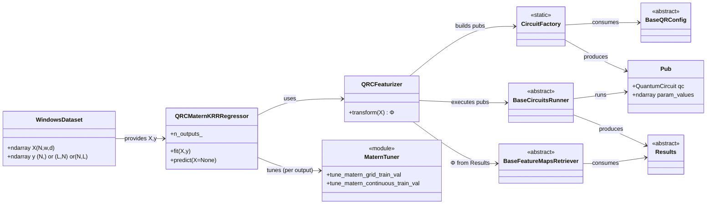

# `src.models` overview

The `src.models` package contains **sklearn-like wrappers** that compose the QRC building blocks from
`src.qrc.*` into end-to-end estimators with `fit()` / `predict()`.

At a high level:

1. **Featurize** a window dataset `X` using quantum circuits to obtain a real feature matrix `Φ`.
2. **Learn** one (or many) label functionals using a classical regressor on top of `Φ`.

---

## Main objects

### `QRCFeaturizer` (`src.models.qrc_featurizer`)
A lightweight, **stateless** transformer:

- **Input:** windows `X` with shape `(N, w, d)`
- Builds a pubs dataset (circuits + parameter binds) using `CircuitFactory`
- Executes pubs with a `BaseCircuitsRunner`
- Converts results into a feature matrix `Φ` with a `BaseFeatureMapsRetriever`

Because it is stateless, the same `Φ` can be reused for many supervised tasks without re-running circuits.

### `QRCMaternKRRRegressor` (`src.models.qrc_matern_krr`)
An end-to-end regressor that combines:

- `QRCFeaturizer` to compute `Φ`
- Matérn kernel ridge regression (KRR) to fit/predict

Workflow:

1. Compute `Φ = featurizer.transform(X)` **once**
2. Split train/test
3. Optionally standardize `Φ`
4. Tune Matérn hyperparameters on a train/validation split
5. Fit KRR in dual form to obtain `α`
6. Predict via `ŷ = K(Φ_test, Φ_train) @ α`

#### Multi-output labels
`fit()` accepts labels `y` in any of:

- `(N,)` single output
- `(L, N)` multiple outputs (preferred internal layout)
- `(N, L)` multiple outputs (transposed internally)

Predictions are returned as:

- `(N_test,)` if `L = 1`
- `(L, N_test)` if `L > 1`

Feature extraction is still performed **once**; KRR tuning+fit is then run once per output.

### `kernel.py` (`src.models.kernel`)
Matérn tuning helpers (used by `QRCMaternKRRRegressor`):

- `tune_matern_grid_train_val`: grid over `ν`, bounded 1D search over `ξ`
- `tune_matern_continuous_train_val`: bounded 2D search over `(ξ, ν)` with Powell
- `krr_val_mse_for_params`: objective used internally by the optimizers

> Backward-compatibility note: `QRCMaternKRRRegressor` tries to import these helpers from `src.models.kernel`,
> and falls back to `src.kernel.finetuning` if your repo still uses the older layout.

---

## High-level interaction diagram



---

## Where this connects to other packages

- **`src.qrc.circuits`**: provides circuit architectures and pubs builders (`CircuitFactory`, configs).
- **`src.qrc.run`**: provides runners and feature-map retrievers (`BaseCircuitsRunner`, `BaseFeatureMapsRetriever`).
- **`src.data`**: provides dataset builders/loaders that output `X` windows and one or many label arrays.

---

## Minimal usage example

Below is a minimal end-to-end example that:

1. builds the model from a YAML config,
2. fits *multiple* label functionals `Y` on the **same** quantum features `Φ`,
3. returns predictions on the internal test split.

```python
import numpy as np
from src.models.qrc_matern_krr import QRCMaternKRRRegressor

# 1) Build from YAML (wires CircuitFactory + Runner + Retriever + tuning config)
mdl = QRCMaternKRRRegressor.from_yaml("configs/qrc_matern_krr.yaml")

# 2) Data: windows X and multiple labels Y
rng = np.random.default_rng(0)
N, w, d = 200, 20, 3
X = rng.normal(size=(N, w, d)).astype(float)

# Multi-output labels:
# - preferred layout: (L, N)
# - also accepted: (N, L)
L = 3
Y = rng.normal(size=(L, N)).astype(float)

# 3) Fit (features Φ computed ONCE; tuning+KRR done once per output)
mdl.fit(X, Y, num_workers=3)

# 4) Predict on the held-out test split (cached during fit)
Yhat = mdl.predict()          # shape: (L, N_test) if L>1
print(Yhat.shape)

# Optional: predict on new windows
# Yhat_new = mdl.predict(X_new)   # X_new shape: (N_new, w, d)
```

**Notes**
- If you only have one target `y` with shape `(N,)`, `fit(X, y)` and `predict()` return a 1D array `(N_test,)`.
- `num_workers` is effectively capped by the number of outputs `L` to avoid spawning idle processes.

