# `src.qrc.run` package overview

This package contains the **execution** and **featurization** layer that sits between:

- `src.qrc.circuits` (which builds **PUBs**: circuits + parameter matrices), and
- downstream models (which consume classical features `Φ`).

Concretely, the package provides:

- **Runners**: execute PUBS datasets on backends such as Qiskit Aer.
- **Results** containers: standardized shapes for simulator outputs.
- **Feature-map retrievers**: convert results into classical feature matrices, either exactly
  (expectation values) or with a shot-noise model (classical-shadow-like).

---

## Big picture: data flow

1. `CircuitFactory` (from `src.qrc.circuits`) builds PUBs from windows `X ∈ R^{N×w×d}`.

   **Template PUB mode (recommended; current default):**
   - `pubs = [(qc_template, vals)]` is a **length-1** list.
   - `vals.shape == (N, R, P_total)` where
     `P_total = (w·n) + (|J| + |h_x| + |h_z| + 1)`.
   - The numeric column order is stored in `qc_template.metadata["param_order"]`.

   **Legacy mode (still supported by the runner):**
   - `pubs = [(qc_i, vals_i)]_{i=1..N}` and `vals_i.shape == (R, P_res)`
     with `P_res = |J| + |h_x| + |h_z| + 1`.
   - Injected inputs are already numeric in `qc_i`; only reservoir params are bound.

2. A `BaseCircuitsRunner` executes `pubs` and returns a `Results` object (typically `ExactResults`). executes `pubs` and returns a `Results` object (typically `ExactResults`).
3. A `BaseFeatureMapsRetriever` converts `Results` into classical features:
   - `Φ ∈ R^{N×(R·K)}` where `K = len(observables)`.
4. Downstream models (KRR / GP / etc.) train on `Φ` and labels `y`.

---

## Mermaid class diagram

```mermaid
classDiagram
direction LR

%% =========================
%% Circuits side (producer)
%% =========================
class BaseQRConfig {
  <<abstract>>
  +int input_dim
  +int num_qubits
  +ndarray projection
}

class CircuitFactory {
  <<static>>
  +create_pubs_dataset_reservoirs_IsingRingSWAP(qrc_cfg, angle_positioning, X, num_reservoirs, lam_0, seed, eps) List~Pub~
}

class Pub {
  <<tuple>>
  +QuantumCircuit qc
  +ndarray param_values  # template: (N,R,P_total) | legacy: (R,P_res)
}

class QuantumCircuit {
  +metadata : dict
}

class QcMetadataContract {
  +J : ParameterVector
  +h_x : ParameterVector
  +h_z : ParameterVector
  +lam : Parameter
  +z : ParameterVector
}

CircuitFactory --> BaseQRConfig : consumes
CircuitFactory --> Pub : produces
Pub --> QuantumCircuit
QuantumCircuit --> QcMetadataContract : metadata keys


%% =========================
%% Run side (executor)
%% =========================
class Results {
  <<abstract>>
  +BaseQRConfig qrc_cfg
  +ndarray states
  +save(file)
  +load(file)
}

class ExactResults {
  +ndarray states  # (N,R,2^n,2^n)
}

Results <|-- ExactResults

class BaseCircuitsRunner {
  <<abstract>>
  +run_pubs(pubs, **kwargs) Results
}

class ExactAerCircuitsRunner {
  +AerSimulator backend
  +run_pubs(pubs, device, optimization_level, seed_simulator, ...) ExactResults
}

BaseCircuitsRunner <|-- ExactAerCircuitsRunner

%% runner interactions
BaseCircuitsRunner --> Pub : runs pubs
ExactAerCircuitsRunner --> BaseQRConfig : uses
ExactAerCircuitsRunner --> QuantumCircuit : executes
ExactAerCircuitsRunner --> QcMetadataContract : reads metadata for param order
ExactAerCircuitsRunner --> ExactResults : produces


%% =========================
%% Run side (featurization)
%% =========================
class FeatureMatrix {
  +ndarray Phi  # (N, R*K)
}

class BaseFeatureMapsRetriever {
  <<abstract>>
  +Sequence observables
  +ndarray fmps  # cached Phi (optional)
  +get_feature_maps(results, **kwargs) ndarray
  +save(path)
  +load(path)
}

class ExactFeatureMapsRetriever {
  +get_feature_maps(results) ndarray  # (N,R*K)
}

class CSFeatureMapsRetriever {
  +get_feature_maps(results, shots, seed, n_groups) ndarray
}

BaseFeatureMapsRetriever <|-- ExactFeatureMapsRetriever
BaseFeatureMapsRetriever <|-- CSFeatureMapsRetriever

%% retriever consumes Results and produces Phi
BaseFeatureMapsRetriever --> Results : consumes
BaseFeatureMapsRetriever --> FeatureMatrix : produces Φ

%% specific expectations / composition
ExactFeatureMapsRetriever --> ExactResults : expects density matrices
CSFeatureMapsRetriever --> ExactResults : expects density matrices
CSFeatureMapsRetriever --> ExactFeatureMapsRetriever : uses for μ
CircuitFactory --> BaseCircuitsRunner : provides pubs
BaseCircuitsRunner --> BaseFeatureMapsRetriever : provides results

```



---

## Modules and main objects

## `circuit_run.py`

### `Results` (abstract) and `ExactResults`
- `Results` defines a minimal persistence interface (`save` / `load`).
- `ExactResults` stores reduced reservoir density matrices with shape:

  - `results.states`: `(N, R, 2**n, 2**n)`

  where:
  - `N` = number of windows (PUBs),
  - `R` = number of reservoir parameterizations per window,
  - `n` = `qrc_cfg.num_qubits`.

### `BaseCircuitsRunner`
Abstract interface: `run_pubs(...) -> Results`.

### `ExactAerCircuitsRunner`
Executes PUBs on Qiskit Aer (`AerSimulator(method="density_matrix")`).

**Key convention (parameter binding order):**
The runner binds parameters using:

- Preferred (template mode): `qc.metadata["param_order"]`
- Fallback (legacy circuits): `list(J) + list(h_x) + list(h_z) + [lam]`
  reconstructed from `qc.metadata`.

This avoids relying on `qc.parameters`, whose order may change after transpilation.

**GPU support:**
If Aer exposes `available_devices()` and reports `"GPU"`, you can pass `device="GPU"` to
`run_pubs`, and the runner will call `backend.set_options(device="GPU", ...)`.

---

## `fmp_retriever.py`

### `BaseFeatureMapsRetriever`
Abstract interface turning `Results` into a classical feature matrix `Φ`.

Includes a simple persistence API:
- `save(path)` pickles the retriever,
- `load(path)` restores it.

### `ExactFeatureMapsRetriever`
Computes exact features:

`Φ[i, r*K + k] = Tr( ρ[i,r] O_k )`

Two evaluation paths:
- **Fast Pauli path** when all observables are single-term Pauli strings (`SparsePauliOp`),
- **Dense fallback** (`Tr(rho O)` via dense matrices) for generic `Operator`s.

Output shape: `Φ ∈ R^{N×(R·K)}`.

---

## `cs_fmp_retriever.py`

### `CSFeatureMapsRetriever`
A simulation-only noisy retriever that mimics shot noise:

1. Uses `ExactFeatureMapsRetriever` to compute exact expectations `μ = Tr(ρ O)`.
2. Simulates `shots` outcomes in `{±1}` with `P(+1)=(1+μ)/2`.
3. Aggregates using **median-of-means** with `n_groups`.

This yields a feature matrix with the same shape/order as the exact retriever.

---

## Shapes & conventions (quick reference)

- `pubs` (template mode): list of length **1**
  - `pub = (qc_template, vals)`
  - `vals`: `(N, R, P_total)` with `P_total = (w·n) + (|J| + |h_x| + |h_z| + 1)`
  - binding order: `qc_template.metadata["param_order"]`
- `pubs` (legacy mode): list of length `N`
  - `pub_i = (qc_i, vals_i)`
  - `vals_i`: `(R, P_res)` with `P_res = |J| + |h_x| + |h_z| + 1`
- `ExactResults.states`: `(N, R, 2**n, 2**n)`
- `Φ` (features): `(N, R*K)` with `K = len(observables)`

## Minimal usage example

```python
import numpy as np
from src.qrc.circuits.qrc_configs import RingQRConfig
from src.qrc.circuits.circuit_factory import CircuitFactory
from src.qrc.circuits.utils import angle_positioning_tanh, generate_k_local_paulis
from src.qrc.run.circuit_run import ExactAerCircuitsRunner
from src.qrc.run.fmp_retriever import ExactFeatureMapsRetriever

qrc_cfg = RingQRConfig(input_dim=3, num_qubits=3, seed=0)

# windows: (N, w, d)
X = np.random.default_rng(0).normal(size=(10, 20, 3))

# Template PUB: pubs is length 1; vals is (N, R, P_total)
pubs = CircuitFactory.create_pubs_dataset_reservoirs_IsingRingSWAP(
    qrc_cfg=qrc_cfg,
    angle_positioning=angle_positioning_tanh,
    X=X,
    num_reservoirs=4,
    lam_0=0.2,
    seed=0,
)

runner = ExactAerCircuitsRunner(qrc_cfg)
results = runner.run_pubs(pubs, device="CPU", optimization_level=1)  # states: (N, R, 2^n, 2^n)

observables = generate_k_local_paulis(locality=1, num_qubits=qrc_cfg.num_qubits)
retriever = ExactFeatureMapsRetriever(qrc_cfg, observables)
Phi = retriever.get_feature_maps(results)  # (N, R*K)
```

---

## Common pitfalls

- **Metadata contract**: `ExactAerCircuitsRunner` requires `qc.metadata["J","h_x","h_z","lam"]` and, in template mode, `qc.metadata["param_order"]`.
  Circuits not built by your `CircuitFactory` usually won’t satisfy this.
- **Observable label length** (exact Pauli path): each Pauli string must have length `num_qubits`,
  e.g. `"ZII"` for `n=3`.
- **GPU tests** should skip gracefully if Aer does not report GPU availability.
